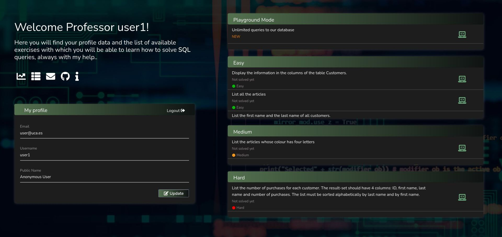
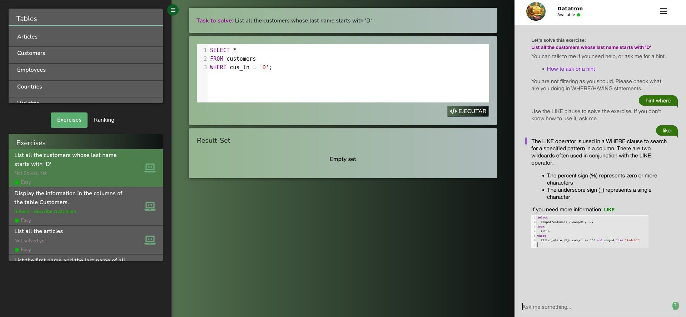
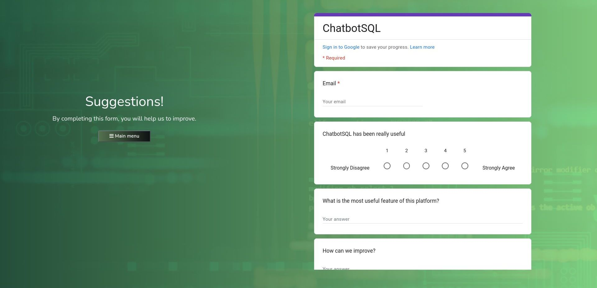

# ChatbotSQL
 
## Introduction

ChatbotSQL is an educational platform to learn SQL by solving exercises. This app will be able to help students thanks to our virtual assistant, created with IBM Watson.

With this platform, we try to improve the learning experience of Databases subject students at University of Cádiz, at the same time that we analyze the most common mistakes and questions.

## Description

### Main Menu:

Once we log in, we can choose between doing exercises or trying the playground mode.

- The exercises will test the user's skills. There are three difficulty levels, which will be unlocked when we solve all the exercises from the previous level.
- The playground mode will allow users to perform some queries freely.



### Game tab:

When we select an exercise or the playground mode, we will see three panels: 
- On the left, we can see the data stored in the database without performing a query. We can also select another problem, and check the students that have completed the current exercise.

- In the middle, we have the text area, in which we have to write the query. The result of the query will appear here too.

- On the right, we have our virtual assistant. It will give us some information.



### Contact:
In this tab we can report the errors we may find. We can also rate the app.




## Running locally

### Compilation requirements, operating environments & dependencies:
- PHP v7.4
- Composer v2.1.9
- Node v16.13.1
- NPM v8.1.2
- MySQL 8.0
- Apache2 Server
- IBM Cloud account


Import this repo:
```
git clone https://github.com/rubenperezm/ChatbotSQL.git
```

Create 3 databases in MySQL and run the scripts included in misc/data. `ChatbotEN.sql` includes some exercises, `db1EN.sql` and `db2EN.SQL`
are the databases used in the exercises.


### App
Go to `src/App` and run these commands:
```
sudo apt-get install -y php7.4-{xml,bcmath,gd,mbstring,xsl,zip,curl,mysql}
composer update
cp .env.example .env
```
We created a .env file. Edit this file to include the databases previously created. You can also modify the URL of the platform, and the URL of the chatbot if needed.

Now, run these commands:
```
php artisan key:generate
sudo chown -R $USER:www-data storage/
sudo chown -R $USER:www-data bootstrap/cache/
sudo chmod -R 775 storage/
sudo chmod -R 775 bootstrap/cache/
php artisan ser
```
At this point, the platform should be visible at `http://localhost:8000`

### IBM Watson Assistant:
Log in to IBM Cloud and create an IBM Watson Assistant service instance. Import the assistant included in misc/IBMWatson.

### BotBD
BotBD is a modified version of [assistant simple](https://github.com/watson-developer-cloud/assistant-simple).
Go to `src/botBD`, and create a `.env` file:
```
cp .env.example .env
```

Now you need to complete `ASSISTANT_URL`, `ASSISTANT_ID` and `ASSISTANT_IAM_APIKEY` fields with the information of your assistant. You can find this information in your assistant settings.

Before you run the server, please change the first line of `botBD/public/js/conversation.js` to include the current URL of the Laravel platform.

Once you have done this, run these commands to install all the dependencies and run the NodeJS server:
```
npm install
npm audit fix
npm start &
```
The chatbot will be running on port 3000.

## About the project

This project has been funded in the call of Teaching Innovation of the University of Cádiz 2021/22 “Proyecto de Innovación Docente de la UCA" (code sol-202100203360-tra).

Participants in this project:
- Antonio Balderas
- Daniel Mejías
- Andrés Muñoz
- Manuel Palomo
- Rubén Pérez
- Juan Francisco Cabrera
